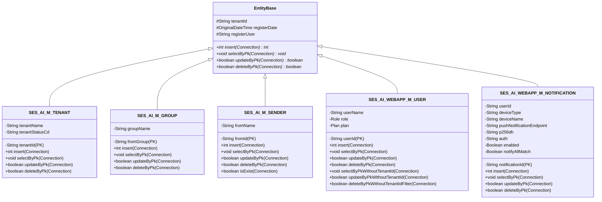

# JPA/Hibernate 移行アーキテクチャ設計書

**バージョン**: 1.0  
**最終更新日**: 2026-08-05  
**ステータス**: Phase 1 計画中

---

## 1. 概要

本設計書は、SesAiAssistantCore ライブラリの ORM（Object-Relational Mapping）をJDBC直接実行からJPA/Hibernateに移行するためのアーキテクチャ設計である。

### 目的
- DB アクセス層の抽象化と保守性向上
- Spring Data JPA による自動CRUD生成
- マルチテナント隔離の透過的な実装（Hibernate Filters）
- PostgreSQL ベクトル型への対応

### 制約
- **Entity メソッドシグネチャ変更なし**: insert/selectByPk/updateByPk/deleteByPk のシグネチャは完全に保持
- **呼び出し側への影響ゼロ**: WebAppBackend など他モジュールは全く変更不要
- **段階的移行**: Phase 1（マスタテーブル）→ Phase 2（トランザクションテーブル）→ Phase 3（複雑クエリ）

---

## 2. 現状アーキテクチャ分析

### 2.1. 現在のJDBC直接実行方式

```
┌─────────────────────────────┐
│   WebAppBackend (呼び出し側)  │
└──────────────┬──────────────┘
               │
               ▼
┌─────────────────────────────┐
│     Entity.insert()         │
│  (JDBC PreparedStatement)   │
└──────────────┬──────────────┘
               │
               ▼
┌─────────────────────────────┐
│   PostgreSQL (RDS)          │
└─────────────────────────────┘
```

**特徴**:
- SQL文をEntity内に `static final String` として埋め込み
- Connection パラメータで DB接続を手動管理
- テナントID によるフィルタリングを手動で WHERE 句に追加
- Prepared Statement バインディングを関数型インターフェースで実装

**課題**:
- SQL の重複（SELECT, UPDATE, DELETE が各Entity で繰り返される）
- テナントフィルタリングの手動管理（ミスのリスク）
- Connection ライフサイクル管理の複雑性

---

## 3. 目標アーキテクチャ（JPA/Hibernate）

### 3.1. 移行後のアーキテクチャ

```
┌─────────────────────────────────────┐
│   WebAppBackend (呼び出し側)          │
│  (変更なし: Entity.insert()を呼び出す) │
└──────────────┬──────────────────────┘
               │
               ▼
┌─────────────────────────────────────┐
│     Entity クラス                     │
│ (JPA @Entity アノテーション)          │
│                                     │
│  public int insert(...) {           │
│    // 内部: EntityManager で直接    │
│    // persist/merge を呼び出す      │
│  }                                  │
└──────────────┬──────────────────────┘
               │
               ▼
┌─────────────────────────────────────┐
│   EntityManager (JPA API)            │
│ (Hibernate による実装)                │
│                                     │
│ - persist(entity)                   │
│ - merge(entity)                     │
│ - find(id)                          │
│ - remove(entity)                    │
└──────────────┬──────────────────────┘
               │
               ▼
┌─────────────────────────────────────┐
│   Hibernate ORM エンジン              │
│                                     │
│ - SQL自動生成                        │
│ - Hibernate Filters (テナント隔離)   │
│ - PostgreSQL Dialect対応             │
└──────────────┬──────────────────────┘
               │
               ▼
┌─────────────────────────────────────┐
│   PostgreSQL (RDS)                  │
└─────────────────────────────────────┘
```

### 3.2. キーポイント

1. **Entity はシグネチャを保持**
   - `public int insert(Connection connection)` は従来通り
   - 内部実装だけ JPA に変更
   - Connection パラメータは使用されない（互換性のため保持）

2. **EntityManager による直接 CRUD 操作**
   - Entity メソッド内で EntityManager を直接使用し persist/merge/find/remove を呼び出す
   - Repository パターンは不使用

3. **Hibernate Filters による透過的テナント隔離**
   - Entity に @FilterDef / @Filter アノテーションを付加
   - 全クエリに自動で `WHERE tenant_id = :tenantId` が追加される

4. **Entity マッピング**
   - @Entity, @Table, @Column アノテーション
   - OriginalDateTime, Money等の Unit値オブジェクトは AttributeConverter で型変換

---

## 4. JPA Entity 設計

### 4.1. Entity のメソッドシグネチャ保持戦略

**Before (JDBC直接実行)**:
```java
@Override
public int insert(Connection connection) throws SQLException {
    return executeInsert(connection, INSERT_SQL, tenantId, (stmt) -> {
        stmt.setString(1, this.tenantId);
        stmt.setString(2, this.tenantName);
        // ...
    }, "SES_AI_M_TENANT.insert");
}
```

**After (JPA/Hibernate)**:
```java
@Entity
@Table(name = "SES_AI_M_TENANT")
@FilterDef(name = "tenantFilter", parameters = @ParamDef(name = "tenantId", type = "string"))
@Filter(name = "tenantFilter", condition = "tenant_id = :tenantId")
public class SES_AI_M_TENANT extends EntityBase {
    
    @Id
    private String tenantId;
    
    @Column(name = "tenant_name")
    private String tenantName;
    
    @Column(name = "register_date")
    private OriginalDateTime registerDate;
    
    // シグネチャ変更なし
    @Override
    public int insert(Connection connection) throws SQLException {
        // 内部実装を JPA に変更
        // 依存注入された EntityManager を使用
        EntityManager entityManager = getEntityManager(); // DIコンテナから取得
        entityManager.persist(this);
        return 1; // 成功時
    }
    
    // 以下同様に selectByPk, updateByPk, deleteByPk を実装
}
```

### 4.2. テナントフィルタリング設計

**Entity クラスの @FilterDef / @Filter**:
```java
@Entity
@Table(name = "SES_AI_T_PERSON")
@FilterDef(
    name = "tenantFilter",
    parameters = @ParamDef(name = "tenantId", type = "string")
)
@Filter(name = "tenantFilter", condition = "tenant_id = :tenantId")
public class SES_AI_T_PERSON extends EntityBase {
    // ...
}
```

**Entity メソッド内で Filter を有効化**:
```java
@Override
public void selectByPk(Connection connection) throws SQLException {
    try {
        EntityManager entityManager = getEntityManager();
        Session session = entityManager.unwrap(Session.class);
        
        // Filter を有効化
        session.enableFilter("tenantFilter").setParameter("tenantId", this.tenantId);
        
        // クエリ実行（自動で WHERE tenant_id = 'xxx' が追加される）
        SES_AI_T_PERSON result = entityManager.find(SES_AI_T_PERSON.class, this.personId);
        if (result != null) {
            // フィールド値を this にコピー
            this.personName = result.getPersonName();
            // ...
        }
    } catch (Exception e) {
        throw new SQLException("Select failed", e);
    }
}
```

### 4.3. Entity クラス図



---

## 6. PostgreSQL Vector型対応戦略

### 6.1. Vector型マッピング方式（複数案）

#### **案1: String として保持（推奨：Phase 1）**

最もシンプルな実装。ベクトル値をJSON文字列として保持。

```java
@Entity
@Table(name = "SES_AI_T_JOB")
public class SES_AI_T_JOB extends EntityBase {
    
    // Vector を文字列として保持
    @Column(name = "vector_data", columnDefinition = "vector(1536)")
    private String vectorData; // JSON形式: "[0.1, 0.2, ...]"
    
    // Getter/Setter
    public String getVectorData() {
        return vectorData;
    }
    
    public void setVectorData(String vectorData) {
        this.vectorData = vectorData;
    }
}
```

**メリット**:
- 実装が簡潔
- PostgreSQL JDBC ドライバで即座に対応可能
- ベクトル検索 SQL は Native Query で実装

**デメリット**:
- Java 側では String のため、型安全性がない
- ベクトル計算（余弦距離など）が必要な場合は複雑

#### **案2: Hibernate Types ライブラリ（中程度）**

サードパーティの Hibernate Types ライブラリを使用。

```xml
<!-- pom.xml に追加 -->
<dependency>
    <groupId>io.github.jklingsporn</groupId>
    <artifactId>hibernate-types-60</artifactId>
    <version>2.20.0</version>
</dependency>
```

```java
@Entity
@Table(name = "SES_AI_T_JOB")
@TypeDef(
    name = "vector",
    typeClass = VectorType.class,
    parameters = @Parameter(name = VectorType.TYPE, value = "vector(1536)")
)
public class SES_AI_T_JOB extends EntityBase {
    
    @Type(type = "vector")
    @Column(name = "vector_data", columnDefinition = "vector(1536)")
    private Vector vectorData; // カスタム Vector クラス
}
```

**メリット**:
- ベクトル検索を Hibernate Query で記載可能
- 型安全性がある

**デメリット**:
- 外部ライブラリに依存
- メンテナンスが必要

#### **案3: カスタム UserType 実装（高度）**

Hibernate UserType インターフェースを実装。

```java
public class VectorUserType implements UserType {
    
    @Override
    public int[] sqlTypes() {
        return new int[] { Types.OTHER };
    }
    
    @Override
    public Class<String> returnedClass() {
        return String.class;
    }
    
    @Override
    public Object nullSafeGet(ResultSet rs, String[] names, SharedSessionContractImplementor session, Object owner)
            throws HibernateException, SQLException {
        // PostgreSQL vector 型を String にマッピング
        String value = rs.getString(names[0]);
        return value;
    }
    
    @Override
    public void nullSafeSet(PreparedStatement st, Object value, int index, SharedSessionContractImplementor session)
            throws HibernateException, SQLException {
        if (value == null) {
            st.setNull(index, Types.OTHER);
        } else {
            st.setObject(index, value, Types.OTHER);
        }
    }
    
    // その他必須メソッド...
}
```

**メリット**:
- 完全にカスタマイズ可能
- ベクトル検索の複雑なロジックに対応

**デメリット**:
- 実装が複雑
- テストが必要

### 6.2. 推奨アプローチ

**Phase 1: 案1（String として保持）**
- シンプルで速速実装可能
- ベクトル検索は Native SQL Query で実装

**Phase 2: 案2（Hibernate Types）への検討**
- 必要に応じてライブラリ追加

---

## 5. pom.xml 依存性設定

### 5.1. 必要な依存性

```xml
<!-- Hibernate ORM -->
<dependency>
    <groupId>org.hibernate.orm</groupId>
    <artifactId>hibernate-core</artifactId>
    <version>6.4.4.Final</version>
</dependency>

<!-- PostgreSQL JDBC ドライバ -->
<dependency>
    <groupId>org.postgresql</groupId>
    <artifactId>postgresql</artifactId>
    <version>42.7.5</version>
</dependency>
```

### 5.2. 削除した依存性

以下の依存性は削除：

- `spring-boot-starter-data-jpa`: Repository パターンは不使用

### 5.3. 既存依存性との確認

以下の依存性は既に pom.xml に含まれているため、バージョン競合がないか確認：

- `postgresql`: 42.7.5 （JDBC ドライバ）
- `lombok`: 1.18.30
- `hibernate-core`: 6.4.4.Final

---

## 6. application.yml 設定

### 6.1. JPA/Hibernate設定例（YAML形式）

```yaml
spring:
  jpa:
    hibernate:
      ddl-auto: validate
    show-sql: false
    properties:
      hibernate:
        dialect: org.hibernate.dialect.PostgreSQL15Dialect
  datasource:
    url: jdbc:postgresql://localhost:5432/ses_ai_assistant
    username: postgres
    password: password
    driver-class-name: org.postgresql.Driver
```

---

## 7. Hibernate Filters による透過的テナント隔離

### 7.1. Entity定義（@FilterDef / @Filter）

**Phase 1対象外のEntity例（テナントフィルタが不要なケース）**:
```java
@Entity
@Table(name = "SES_AI_M_TENANT")
// SES_AI_M_TENANT はテナント管理者用のため、@Filter不要
public class SES_AI_M_TENANT extends EntityBase {
    // ...
}
```

**テナントフィルタが必要なEntity例**:
```java
@Entity
@Table(name = "SES_AI_M_GROUP")
@FilterDef(
    name = "tenantFilter",
    parameters = @ParamDef(name = "tenantId", type = "string")
)
@Filter(name = "tenantFilter", condition = "tenant_id = :tenantId")
public class SES_AI_M_GROUP extends EntityBase {
    // ...
}
```

### 7.2. Entity メソッド内で Filter を有効化

```java
@Override
public void selectByPk(Connection connection) throws SQLException {
    try {
        EntityManager entityManager = getEntityManager();
        Session session = entityManager.unwrap(Session.class);
        
        // Filter を有効化
        session.enableFilter("tenantFilter").setParameter("tenantId", this.tenantId);
        
        try {
            SES_AI_M_GROUP result = entityManager.find(SES_AI_M_GROUP.class, this.fromGroup);
            if (result != null) {
                // フィールド値を this にコピー
                this.groupName = result.getGroupName();
                // ...
            }
        } finally {
            // Filter を無効化（重要）
            session.disableFilter("tenantFilter");
        }
    } catch (Exception e) {
        throw new SQLException("Select failed", e);
    }
}
```

---

## 8. Unit値オブジェクト の JPA マッピング

### 8.1. OriginalDateTime 型

**現在の実装**:
```java
// Unit値オブジェクト
public class OriginalDateTime {
    private final LocalDateTime value;
    
    public Timestamp toTimestamp() {
        return Timestamp.valueOf(this.value);
    }
}
```

**JPA AttributeConverter で対応**:
```java
@Converter(autoApply = true)
public class OriginalDateTimeConverter implements AttributeConverter<OriginalDateTime, LocalDateTime> {
    
    @Override
    public LocalDateTime convertToDatabaseColumn(OriginalDateTime attribute) {
        return attribute == null ? null : attribute.getValue(); // getValue() メソッド必要
    }
    
    @Override
    public OriginalDateTime convertToEntityAttribute(LocalDateTime dbData) {
        return dbData == null ? null : new OriginalDateTime(dbData);
    }
}
```

**Entity での使用**:
```java
@Entity
@Table(name = "SES_AI_M_TENANT")
public class SES_AI_M_TENANT extends EntityBase {
    
    @Column(name = "register_date")
    @Convert(converter = OriginalDateTimeConverter.class)
    private OriginalDateTime registerDate;
}
```

### 8.2. Money 型（必要な場合）

```java
@Converter(autoApply = true)
public class MoneyConverter implements AttributeConverter<Money, BigDecimal> {
    
    @Override
    public BigDecimal convertToDatabaseColumn(Money attribute) {
        return attribute == null ? null : attribute.getValue();
    }
    
    @Override
    public Money convertToEntityAttribute(BigDecimal dbData) {
        return dbData == null ? null : new Money(dbData);
    }
}
```

### 8.3. Role / Plan Enum 型

```java
@Entity
@Table(name = "SES_AI_WEBAPP_M_USER")
public class SES_AI_WEBAPP_M_USER extends EntityBase {
    
    @Column(name = "role_cd")
    @Enumerated(EnumType.STRING) // または ORDINAL
    private Role role;
    
    @Column(name = "plan_cd")
    @Enumerated(EnumType.STRING)
    private Plan plan;
}
```

---

## 9. エラーハンドリング戦略

### 9.1. JPA 例外のハンドリング

**DataIntegrityViolationException** (一意制約違反など)
```java
try {
    EntityManager entityManager = getEntityManager();
    entityManager.persist(tenant);
} catch (PersistenceException e) {
    log.error("Persist failed: {}", e.getMessage());
    throw new SQLException("レコードが既に存在します", e);
}
```

**EntityNotFoundException** (レコード未検出)
```java
public void selectByPk(Connection connection) throws SQLException {
    try {
        EntityManager entityManager = getEntityManager();
        SES_AI_M_TENANT result = entityManager.find(SES_AI_M_TENANT.class, this.tenantId);
        if (result == null) {
            log.warn("Tenant not found: {}", this.tenantId);
            // 呼び出し側が this のフィールドが未設定であることで検知
            return;
        }
        // 結果を this にセット
        this.tenantName = result.getTenantName();
        // ...
    } catch (Exception e) {
        throw new SQLException("Select failed", e);
    }
}
```

### 9.2. Connection パラメータのハンドリング

Entity メソッドは Connection パラメータを受け取るが、JPA では使用しない。

```java
@Override
public int insert(Connection connection) throws SQLException {
    // connection パラメータは使用しない（null チェック不要）
    // 内部的に EntityManager を使用
    try {
        EntityManager entityManager = getEntityManager();
        entityManager.persist(this);
        return 1;
    } catch (Exception e) {
        throw new SQLException("Insert failed", e);
    }
}
```

---

## 10. トランザクション管理

### 10.1. EntityManager でのトランザクション制御

```java
@Override
public int insert(Connection connection) throws SQLException {
    try {
        EntityManager entityManager = getEntityManager();
        EntityTransaction transaction = entityManager.getTransaction();
        
        transaction.begin();
        try {
            entityManager.persist(this);
            transaction.commit();
            return 1;
        } catch (Exception e) {
            if (transaction.isActive()) {
                transaction.rollback();
            }
            throw new SQLException("Insert failed", e);
        }
    } catch (Exception e) {
        throw new SQLException("Insert failed", e);
    }
}
```

### 10.2. Spring トランザクション管理

Spring を使用する場合は @Transactional を活用：

```java
@Service
@Transactional(rollbackFor = {SQLException.class, Exception.class})
public class TenantService {
    
    public void registerTenant(SES_AI_M_TENANT tenant) throws SQLException {
        // 自動トランザクション管理
        tenant.insert(null); // Connection は null でOK
    }
}
```

---

## 11. Phase 別移行計画

### 11.1. Phase 1: マスタテーブル（本設計書の対象）

**対象Entity**:
- `SES_AI_M_TENANT`
- `SES_AI_M_GROUP`
- `SES_AI_M_SENDER`
- `SES_AI_WEBAPP_M_USER`
- `SES_AI_WEBAPP_M_NOTIFICATION`

**実装内容**:
- @Entity, @Table, @Column アノテーション追加
- Entity メソッド (insert/selectByPk等) の内部実装を JPA に変更（EntityManager を直接使用）
- pom.xml に Hibernate 依存性を保持
- application.yml に JPA/Hibernate 設定追加

**テスト範囲**:
- Unit Test: EntityManager CRUD 動作確認
- IT1 Test: Entity メソッドのシグネチャ互換性確認

### 11.2. Phase 2: トランザクションテーブル（将来）

**対象Entity**:
- `SES_AI_T_JOB`
- `SES_AI_T_PERSON`
- `SES_AI_T_SKILLSHEET`
- `SES_AI_T_MATCH`
- `SES_AI_T_WATCH`

**実装内容**:
- ベクトル検索対応 (Vector型 マッピング)
- 複雑クエリ対応 (Native SQL)
- Pagination 実装

### 11.3. Phase 3: 複雑クエリ最適化（将来）

**実装内容**:
- Native SQL Query への移行
- 性能チューニング
- インデックス最適化

---

## 12. チェックリスト（実装時）

- [ ] pom.xml から spring-boot-starter-data-jpa を削除
- [ ] pom.xml に Hibernate 依存性があることを確認
- [ ] application.yml に JPA/Hibernate 設定を追加
- [ ] Phase 1 対象の Entity に @Entity, @Table, @Column, @Converter アノテーション追加
- [ ] Entity メソッド (insert/selectByPk等) の内部実装を JPA に変更（EntityManager を直接使用）
- [ ] AttributeConverter (OriginalDateTime等) を実装
- [ ] Unit Test で EntityManager CRUD 動作を確認
- [ ] IT1 Test で Entity メソッドのシグネチャ互換性を確認
- [ ] Hibernate Filters の設定と動作確認
- [ ] Connection null チェック を削除
- [ ] SQL文 (INSERT_SQL 等) が削除されていることを確認
- [ ] Repository ディレクトリが削除されていることを確認

---

## 13. 参考資料

- [Hibernate ORM 6.4 User Guide](https://docs.jboss.org/hibernate/orm/6.4/userguide/html_single/Hibernate_User_Guide.html)
- [PostgreSQL Dialect for Hibernate](https://docs.jboss.org/hibernate/orm/6.4/userguide/html_single/Hibernate_User_Guide.html#database-dialect)
- [PostgreSQL 15 Vector型](https://pgvector.readthedocs.io/)

---

**ドキュメント作成者**: Copel Co., Ltd.  
**最終確認**: 2026-08-05
