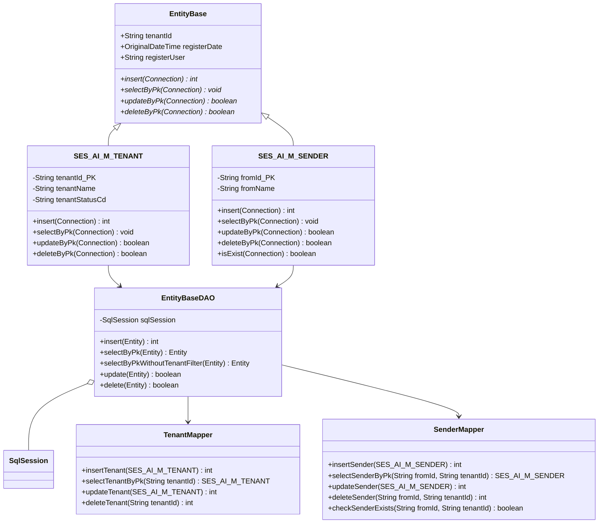

# MyBatis移行設計 - ORM マッパー アーキテクチャ設計書

**作成日**: 2026-08-05  
**対象**: SesAiAssistantCore - DBアクセス層  
**ステータス**: 設計フェーズ1（マスタテーブル）

---

## 1. 概要

本設計書は、SesAiAssistantCore の現状アーキテクチャ（テンプレートメソッド + 関数型インターフェース）から、MyBatis ORM（オブジェクト-リレーショナル・マッピング）への段階的な移行方針を定義します。

### 目的
- DB アクセス処理の DRY（Don't Repeat Yourself）原則徹底化
- SQL 管理の一元化と再利用性向上
- テナント隔離・テナント ID 絞り込み処理の自動化
- PostgreSQL 拡張型（Vector、Money など）の型安全な取扱い

### スコープ
- **Phase 1**: マスタテーブル（5テーブル）の MyBatis 化
  - SES_AI_M_TENANT
  - SES_AI_M_GROUP
  - SES_AI_M_SENDER
  - SES_AI_WEBAPP_M_USER
  - SES_AI_WEBAPP_M_NOTIFICATION
- **Phase 2以降**: トランザクションテーブルの移行

---

## 2. 現状アーキテクチャ分析

### 2.1 テンプレートメソッド パターンの構成

```
EntityBase (抽象基底クラス)
    ↓
    ├─ 関数型インターフェース
    │  ├─ PreparedStatementBinder
    │  └─ ResultSetMapper
    ↓
executeInsert / executeSelectByPk / executeUpdateByPk / executeDeleteByPk
    ↓
具体的Entity（SES_AI_M_TENANT等）
```

**特徴**:
- Connection を直接使用し、PreparedStatement を操作
- テナント ID フィルタリングをテンプレートメソッド内で自動適用
- 各 Entity で SQL 文をハードコード（static final String）

**課題**:
1. SQL 文が Entity クラスに分散
2. TypeHandler 相当の型変換ロジックが Entity に混在
3. 複雑な結果マッピング（Vector、Money等）の処理が冗長
4. SQL の再利用が困難
5. テナント ID 自動追加の複雑さ（文字列加工）が Entity に負荷

---

## 3. 目標アーキテクチャ

### 3.1 MyBatis 導入による構成

```
┌─────────────────────────────────────────────────────────┐
│ Entity クラス（SES_AI_M_TENANT等）                      │
│ - CRUD メソッド：insert/selectByPk/updateByPk/deleteByPk │
│ - メソッドシグネチャ：変更なし（実装は MyBatis へ委譲）    │
└─────────────────────────────────────────────────────────┘
                        ↓（委譲）
┌─────────────────────────────────────────────────────────┐
│ DAOクラス（EntityBaseDAO等）                             │
│ - SqlSession を使用した CRUD実装                         │
│ - テナント ID フィルタリング自動適用                       │
│ - トランザクション境界の明確化                             │
└─────────────────────────────────────────────────────────┘
                        ↓
┌─────────────────────────────────────────────────────────┐
│ MyBatis Mapper XML（*.mapper.xml）                       │
│ - SQL 管理の一元化                                       │
│ - ResultMap による型マッピング                            │
│ - where 句テンプレート（tenantId自動追加）                │
└─────────────────────────────────────────────────────────┘
                        ↓
┌─────────────────────────────────────────────────────────┐
│ MyBatis TypeHandler                                       │
│ - Vector ⇔ String 変換（VectorTypeHandler）              │
│ - Money ⇔ Decimal 変換（MoneyTypeHandler）               │
│ - OriginalDateTime ⇔ Timestamp 変換                      │
└─────────────────────────────────────────────────────────┘
                        ↓
┌─────────────────────────────────────────────────────────┐
│ PostgreSQL データベース                                   │
└─────────────────────────────────────────────────────────┘
```

---

## 4. クラス図

### 4.1 Entity → DAO → Mapper の関係図



---

## 5. 実装変更箇所の詳細

### 5.1 EntityBase.java の変更方針

**現在の実装**（テンプレートメソッド）:
```java
protected int executeInsert(
    final Connection conn,
    final String sql,
    final String tenantId,
    final PreparedStatementBinder paramBinder,
    final String logLabel)
    throws SQLException {
  // SQL 加工 + PreparedStatement 実行
}
```

**移行後の実装**（MyBatis 委譲）:
```java
public int insert(Connection connection) throws SQLException {
    // 従前のシグネチャは維持
    // DAO を通じて MyBatis SqlSession を実行
    EntityBaseDAO dao = new EntityBaseDAO(sqlSessionFactory);
    return dao.insert(this);
}
```

### 5.2 具体的Entity の変更箇所（SES_AI_M_TENANT の例）

**現在**:
```java
@Override
public int insert(Connection connection) throws SQLException {
    return executeInsertWithoutTenantFilter(
        connection,
        INSERT_SQL,
        (stmt) -> {
          stmt.setString(1, this.tenantId);
          stmt.setString(2, this.tenantName);
          // ... バインディング処理
        },
        "SES_AI_M_TENANT.insert");
}
```

**移行後**:
```java
@Override
public int insert(Connection connection) throws SQLException {
    // 内部で DAO → SqlSession.insert() を呼び出し
    return TenantDAO.getInstance().insert(this);
}
```

---

## 6. MyBatis Mapper XML の設計方針

### 6.1 テンプレート構造

```xml
<?xml version="1.0" encoding="UTF-8" ?>
<!DOCTYPE mapper PUBLIC 
    "-//mybatis.org//DTD Mapper 3.0//EN"
    "http://mybatis.org/dtd/mybatis-3-mapper.dtd">

<mapper namespace="copel.sesproductpackage.core.database.mapper.TenantMapper">
    
    <!-- ResultMap: DB カラム → Java プロパティの対応 -->
    <resultMap id="TenantMap" type="copel.sesproductpackage.core.database.SES_AI_M_TENANT">
        <id column="tenant_id" property="tenantId" />
        <result column="tenant_name" property="tenantName" />
        <result column="tenant_status_cd" property="tenantStatusCd" />
        <result column="register_date" property="registerDate" typeHandler="OriginalDateTimeTypeHandler" />
        <result column="register_user" property="registerUser" />
    </resultMap>
    
    <!-- INSERT: tenant_id は自動追加（DAO層で処理） -->
    <insert id="insertTenant" parameterType="SES_AI_M_TENANT">
        INSERT INTO SES_AI_M_TENANT 
            (tenant_id, tenant_name, tenant_status_cd, register_date, register_user)
        VALUES
            (#{tenantId}, #{tenantName}, #{tenantStatusCd}, #{registerDate}, #{registerUser})
    </insert>
    
    <!-- SELECT-by-PK: マスタテーブル（tenantId フィルタなし） -->
    <select id="selectByPk" parameterType="string" resultMap="TenantMap">
        SELECT tenant_id, tenant_name, tenant_status_cd, register_date, register_user
        FROM SES_AI_M_TENANT
        WHERE tenant_id = #{tenantId}
    </select>
    
    <!-- UPDATE-by-PK -->
    <update id="updateByPk" parameterType="SES_AI_M_TENANT">
        UPDATE SES_AI_M_TENANT
        SET 
            tenant_name = #{tenantName},
            tenant_status_cd = #{tenantStatusCd}
        WHERE tenant_id = #{tenantId}
    </update>
    
    <!-- DELETE-by-PK -->
    <delete id="deleteByPk" parameterType="string">
        DELETE FROM SES_AI_M_TENANT
        WHERE tenant_id = #{tenantId}
    </delete>
</mapper>
```

### 6.2 テナント ID フィルタリングの自動化

**トランザクションテーブル用（Phase 2以降）**:
```xml
<!-- SES_AI_M_SENDER: テナント ID フィルタ付き -->
<select id="selectByPkWithTenantId" parameterType="map" resultMap="SenderMap">
    SELECT from_id, from_name, register_date, register_user
    FROM SES_AI_M_SENDER
    WHERE from_id = #{fromId}
      AND tenant_id = #{tenantId}  <!-- 自動追加されるフィルタ -->
</select>
```

---

## 7. MyBatis TypeHandler の設計

### 7.1 対応する特殊型

| Java 型 | PostgreSQL 型 | TypeHandler | 用途 |
| :--- | :--- | :--- | :--- |
| `Vector` | `vector(1536)` | `VectorTypeHandler` | AI ベクトル埋め込み |
| `Money` | `NUMERIC(10, 2)` | `MoneyTypeHandler` | 金額管理（単価等） |
| `OriginalDateTime` | `timestamp` | `OriginalDateTimeTypeHandler` | タイムゾーン対応日時 |
| `Role` (Enum) | `VARCHAR(10)` | （MyBatis デフォルト） | ロール管理 |
| `Plan` (Enum) | `VARCHAR(10)` | （MyBatis デフォルト） | プラン管理 |

### 7.2 TypeHandler 実装例

**VectorTypeHandler**:
```java
public class VectorTypeHandler extends BaseTypeHandler<Vector> {
    @Override
    public void setNonNullParameter(
        PreparedStatement ps, int i, Vector parameter, JdbcType jdbcType)
        throws SQLException {
        // Java Vector -> PostgreSQL vector 文字列
        ps.setString(i, parameter.toPostgresString());
    }
    
    @Override
    public Vector getNullableResult(ResultSet rs, String columnName)
        throws SQLException {
        String vectorStr = rs.getString(columnName);
        return vectorStr != null ? Vector.parse(vectorStr) : null;
    }
    
    @Override
    public Vector getNullableResult(ResultSet rs, int columnIndex)
        throws SQLException {
        String vectorStr = rs.getString(columnIndex);
        return vectorStr != null ? Vector.parse(vectorStr) : null;
    }
    
    @Override
    public Vector getNullableResult(CallableStatement cs, int columnIndex)
        throws SQLException {
        String vectorStr = cs.getString(columnIndex);
        return vectorStr != null ? Vector.parse(vectorStr) : null;
    }
}
```

---

## 8. エラーハンドリング戦略

### 8.1 SQLException → RuntimeException への変換

**現状**:
```java
public int insert(Connection connection) throws SQLException {
    // SQLException がスローされる
}
```

**移行後**（MyBatis）:
```java
public int insert(Connection connection) {
    try {
        return dao.insert(this);
    } catch (SQLException e) {
        throw new DataAccessException(
            "Failed to insert entity: " + this.getClass().getSimpleName(), e);
    }
}
```

### 8.2 リソース未検出の処理

```java
// selectByPk の例
public void selectByPk(Connection connection) throws SQLException {
    try {
        SES_AI_M_SENDER entity = dao.selectByPk(this);
        if (entity == null) {
            log.warn("Sender not found: fromId={}, tenantId={}", 
                this.fromId, this.tenantId);
            // Entity の状態は null のまま（変更なし）
        } else {
            // resultMapper で Java オブジェクトにマッピング済み
            this.copyFrom(entity);
        }
    } catch (SQLException e) {
        throw new DataAccessException("Query failed", e);
    }
}
```

---

## 9. トランザクション管理方針

### 9.1 Connection から SqlSession へ

**現状（Connection ベース）**:
```java
Connection conn = getConnection();
try {
    entity1.insert(conn);
    entity2.insert(conn);
    conn.commit();
} catch (SQLException e) {
    conn.rollback();
}
```

**移行後（SqlSession ベース）**:
```java
SqlSession session = sqlSessionFactory.openSession();
try {
    dao.insert(entity1, session);
    dao.insert(entity2, session);
    session.commit();
} catch (Exception e) {
    session.rollback();
} finally {
    session.close();
}
```

### 9.2 トランザクション境界の明確化

- Entity の insert/update/delete メソッドは **トランザクション非関与**
- DAO 層で SqlSession のライフサイクルを管理
- サービス層でトランザクション境界を定義

---

## 10. 移行計画（フェーズ別）

### Phase 1：マスタテーブル（予定所要日数: 10日）

1. **MyBatis 依存性の追加**（1日）
   - `pom.xml` に `mybatis-spring-boot-starter` を追加
   - mybatis-config.xml の作成

2. **TypeHandler の実装**（2日）
   - VectorTypeHandler
   - MoneyTypeHandler
   - OriginalDateTimeTypeHandler

3. **DAO 層の実装**（3日）
   - EntityBaseDAO
   - 各マスタ DAO クラス

4. **Mapper XML の作成**（2日）
   - entity-mapper.xml（テンプレート）
   - マスタ別 mapper

5. **Entity の移行**（2日）
   - insert/selectByPk/updateByPk/deleteByPk を DAO 委譲に変更
   - UT 修正

### Phase 2以降：トランザクションテーブル

- SES_AI_T_JOB
- SES_AI_T_PERSON
- SES_AI_T_SKILLSHEET
- SES_AI_T_MATCH

---

## 11. 重要な制約・注意事項

### 11.1 メソッドシグネチャの不変性

✅ **必須**:
```java
public int insert(Connection connection) throws SQLException;
public void selectByPk(Connection connection) throws SQLException;
public boolean updateByPk(Connection connection) throws SQLException;
public boolean deleteByPk(Connection connection) throws SQLException;
```

- Connection パラメータは削除**不可**（他モジュールとの互換性）
- 戻り値型は変更不可

### 11.2 テナント隔離の継続

- マスタテーブル（SES_AI_M_TENANT等）でも tenantId フィルタは必須
- マスタテーブルの場合は、データベース側で `DEFAULT 'default'` 指定
- トランザクションテーブルは常に tenantId フィルタ付きで照会

### 11.3 PostgreSQL 拡張機能の活用

- `<=>` 演算子（ベクトル距離）は Mapper XML の SQL に直接記述
- `similarity()` 関数も SQL に直接記述
- TypeHandler は型変換のみ、SQL 生成は行わない

---

## 12. テスト戦略

### 12.1 UT（単体テスト）

- Entity の CRUD メソッドのテスト（従前と同じ）
- DAO の CRUD テスト（SqlSession モック）
- TypeHandler の変換ロジック

### 12.2 IT1（統合テスト）

- MyBatis 設定の検証
- Mapper XML の SQL 文法チェック
- テナント ID フィルタリングの確認

### 12.3 E2E（システムテスト）

- WebApp Backend API → Core DAO → DB への連携確認
- 他モジュール（Lambda等）への影響なし

---

## 13. 参考資料

- [MyBatis 公式ドキュメント](https://mybatis.org/)
- [MyBatis TypeHandler ドキュメント](https://mybatis.org/mybatis-3/configuration.html#typeHandlers)
- PostgreSQL Vector 型: `pgvector` 拡張
- 本プロジェクト EntityBase 設計: `/SesAiAssistantCore/src/main/java/copel/sesproductpackage/core/database/base/EntityBase.java`

---

**承認**: 待機中  
**最終更新**: 2026-08-05
